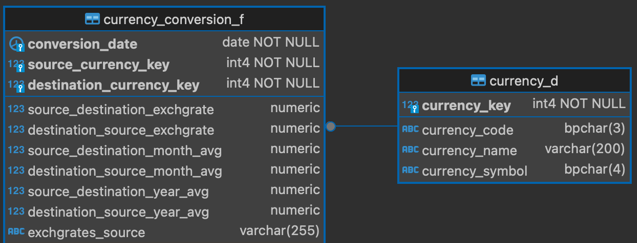
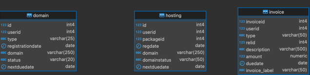

# Project Overview
This project contains SQL scripts and analysis tools for importing data from CSV files into a PostgreSQL database using Docker.

## Assignment 1 Description
The project includes SQL scripts and configuration files for importing currency conversion data from CSV files into the database.

The the [assignment_1.sql](./assignment_1.sql) script allows an external application to save in the table currency_conversion_F the exchange rates from pound to €, and from $ to € (GBP->EUR e USD->EUR). 
The application is able to retrieve the exchange rate; in days when stock exchanges are closed, it retrieves the value from the last working day.

Given an amount, a date, and the pair (currency 1, currency 2), converts amount from currency 1 to currency 2, using the exchange rate, which is closer in time to date, independently if closer in the past or in the future.
In presence of DML operations on currency_conversion_F, the [assignment_1.sql](./assignment_1.sql) mean monthly and mean yearly values of exchange rates wherever present.

### Files
- [currency_d.csv](./currency_d.csv)
- [currency_conversion_f.csv](./currency_conversion_f.csv)

### Requirements
To successfully run the project, Docker must be installed on your system.

### Instructions
1. Clone the repository to a local environment.
2. Navigate to the project directory.
3. Run the command `docker-compose up` to start the Docker environment.
4. Once the PostgreSQL container is up and running, execute the SQL scripts to create tables and import data from CSV files.

----
----

## Assignment 2 Description
The project contains tools for analyzing and importing data generated by a billing system for hosting and domain products.

- Given the ER without explicit relationships, the [assignment_2_calc_percent_likelihood.sql](./assignment_2_calc_percent_likelihood.sql) script calculates the likelihood %.
- The [assignment_2.sql](./assignment_2.sql) script orders, from most to least recent, invoices for each product, labelling them as “new” or “renew” (where the first purchase, given the customer and the product, will be flagged as “new”). On top of that, in the final part produces a query view of the revenue referring to invoices expiring on 01/10/2019, broken down into product type, only for products with status = “Active”.

### Files
- [domain.csv](./domain.csv)
- [hosting.csv](./hosting.csv)
- [invoice.csv](./invoice.csv)

### Requirements
To successfully run the project, Docker must be installed on your system.

### Instructions
1. Clone the repository to a local environment.
2. Navigate to the project directory.
3. Run the command `docker-compose up` to start the Docker environment.
4. Once the PostgreSQL container is up and running, execute the SQL scripts to create tables and import data from CSV files.
5. Follow the specific instructions for each Assignment, as described in the appropriate section.
